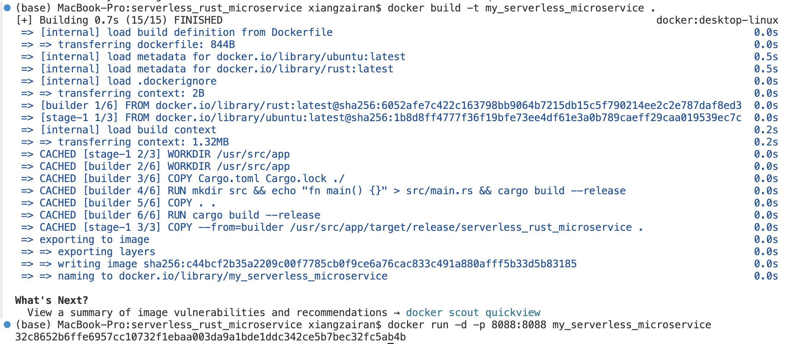

# Rust Microservice

This project is a Continuous Delivery of Rust Microservice that return the number of students in each ap classes. This function is based on mini-project5

# Requirements
- Simple REST API/web service in Rust
- Dockerfile to containerize service
- CI/CD pipeline files

## Please refer to the demo video in the repo: demo.mp4

## Author
Zairan Xiang

## Procedures:

1. Create a new Rust Project:
```cargo new new_project```

2. Add dependencies to Cargo.toml file.

3. Develop application code in the src/main.rs file

4. Containerize the Rust Actix Web App: 

```bash
FROM rust:1.75 AS builder

# Set the working directory
WORKDIR /usr/src/my_serverless_microservice

# Change the user to root
USER root

# Copy everything
COPY . .

# Build the project
RUN cargo build --release

# Expose port 8080
EXPOSE 8080

# Define the default command to run
CMD cargo run
```

5. Dockerfile to containerize service
- build the image based on the Dockerfile by running:
```docker build -t my_serverless_microservice .```
- build a container based on the image my_serverless_microservice:
```docker run -p 8080:8080 my_serverless_microservice```



6. configure CI/CD pipeline to build and deploy Dockerfile

in the .gitlab-ci.yml file:
```
# Define stages for the pipeline
stages:
  - build

# Define variables that can be used across jobs
variables:
  DOCKERHUB_USERNAME: "your Docker Hub email" 
  DOCKERHUB_PASSWORD: "your Docker Hub password or personal access token" 
  IMAGE_TAG: $CI_REGISTRY_IMAGE:$CI_COMMIT_REF_SLUG
  DOCKER_HOST: tcp://docker:2375
  DOCKER_DRIVER: overlay2

build:
  stage: build
  image: docker:stable # Use the Docker image for running Docker commands
  services:
    - docker:dind # Enable Docker-in-Docker service for building Docker images
  before_script:
    - echo "$DOCKERHUB_PASSWORD" | docker login -u "$DOCKERHUB_USERNAME" --password-stdin
  script:
    - docker build -t my_serverless_microservice .
    - docker run -d -p 8088:8088 my_serverless_microservice
    - docker ps -a
```
navigate to the setting page of this Gitlab project, defined DOCKERHUB_USERNAME and DOCKERHUB_PASSWORD as CI/CD variables, fill in the corresponding values with Docker Hub username and password store Docker Hub credentials.

